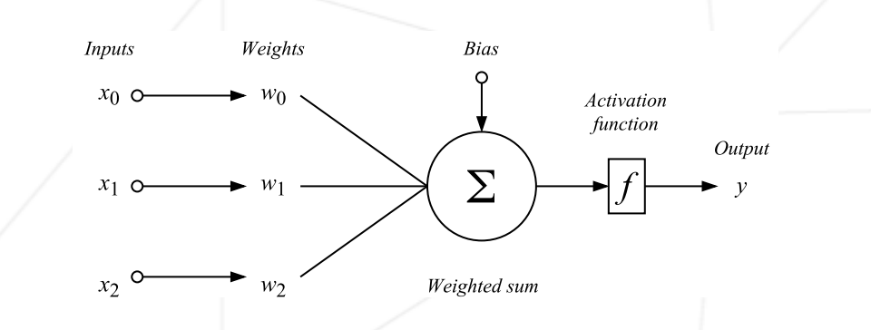
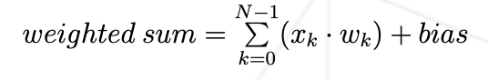

# multilayer_perceptron

[link youtube playlist](https://youtube.com/playlist?list=PLZHQObOWTQDNU6R1_67000Dx_ZCJB-3pi&si=ysk4gfgvWGk8oHjy) 
[link medium how to build a mlp from scratch](https://elcaiseri.medium.com/building-a-multi-layer-perceptron-from-scratch-with-numpy-e4cee82ab06d)

## Run prog
1. git clone repo
2. python -m venv .venv
3. activate venv
4. pip install -r requirements.txt
5. Download dataset in ./dataset/
6. python3 main.py

## What is a Multi-Layer Perceptron?
An MLP is a type of neural network consisting of at least three layers: an input layer, one or more hidden layers, and an output layer. Each neuron in one layer is connected to every neuron in the next layer. The MLP learns by adjusting the weights of these connections to minimize the error of its predictions, using a process called backpropagation.

## Neural Network
We have 32 column in our data.csv so we'll have 32 inputs and then we will build layers after that will process these inputs, then go to another layer, process again to finally give an answer.
The layers between inputs and result are called hidden layers.
We can go from a layer to another using a specific function that will take all the value from previous layer combined with weights.
To this we will add a bias to maximize the incative time of a neuron in the layer.
So the precision of our prediction will be based on the accuracy of the weights and bias.
The value of every neuron will be normalized between 0 and 1 with the sigmoid function.
It's useful to see a neuron more as a function than a value.

## Training
The goal of the training process is to adjust weights and bias.
To do this, we will give to our neural network random values as weights and bias and determine how bad is the result.
This is called a cost function, basically we will determine how far the given result is from truth. 
Based on this cost function, once we have a result we will use the backpropagation to adjust those weights and bias.

## Backpropagation
Backpropagtion is going from the result layer to the first layer.
The goal here is to increase weights of the neuron that were on the good direction and decrease those who gave a really bad answer.
So for each layer, we will increase the weights or decrease them based on their importance in the final answer.

## Prediction
Each neuro will use this function to give an output based in the weights, bias and values of precedent layer's neurons.
To this we want to apply the sigmoid function to have a value between 0 and 1. 

